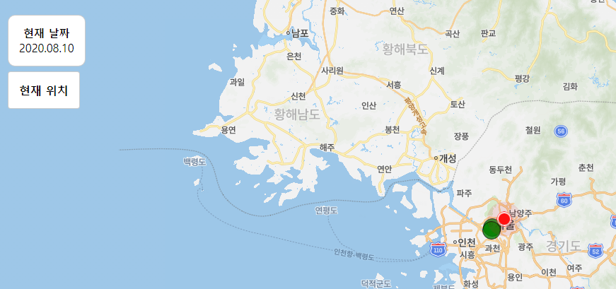

# clone-corona-map
코로나맵 클론코딩



## Prerequisites

* Node.js 12.18.3 LTS

## How to use

1. open cmd
2. type ```npm install```
3. type ```node .\server.js```
3. type ```localhost:3000``` in cmd
4. enjoy (However, you have to change ```ncpClientId``` in index.html)

## Reference

[[link]](https://www.inflearn.com/course/%EC%BD%94%EB%A1%9C%EB%82%98%EB%A7%B5-%EC%A7%80%EB%8F%84%EC%84%9C%EB%B9%84%EC%8A%A4)
